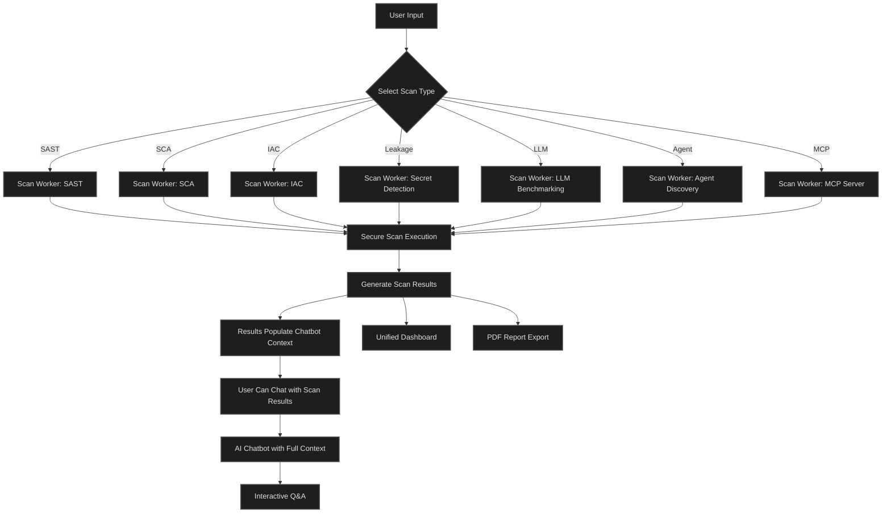
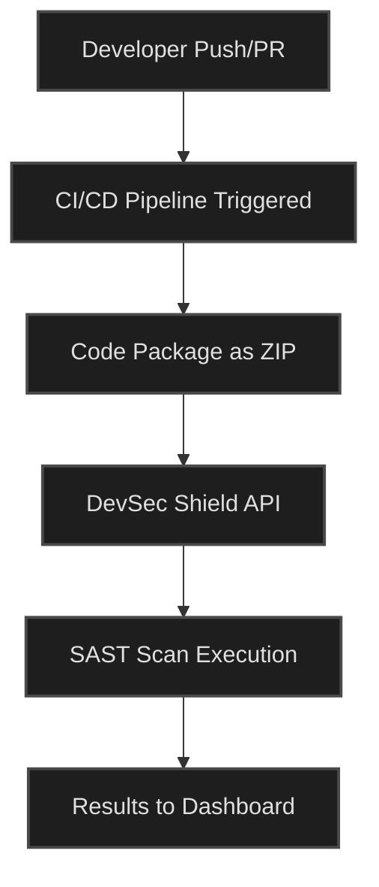
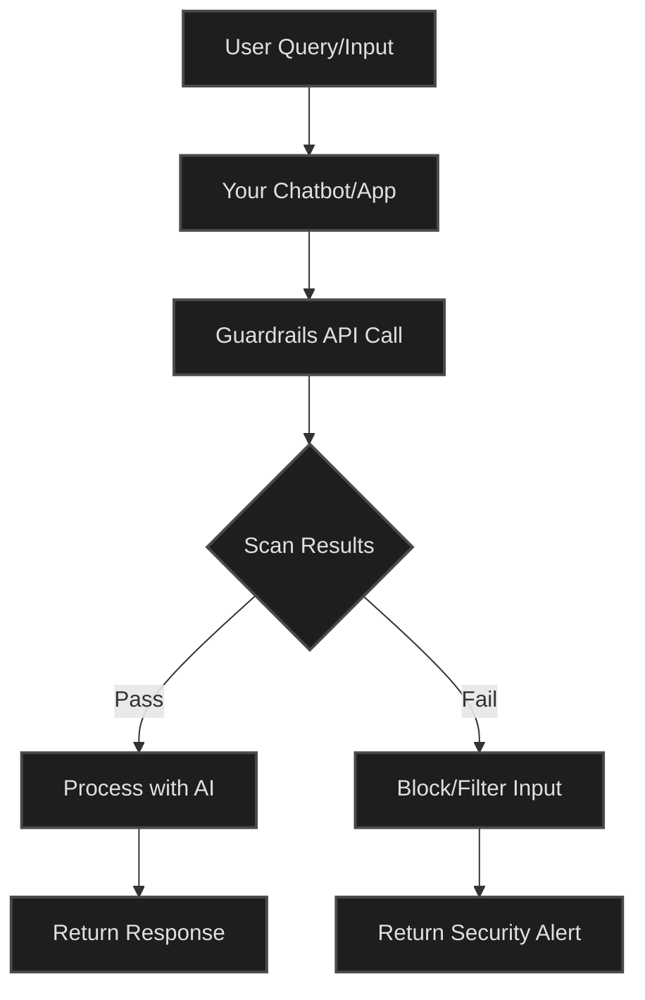
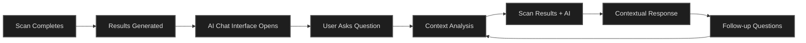

# 🛡️ DevSec Shield

### _Enterprise-Grade Security Scanning & Intelligence Platform Enhanced by AI_

DevSec Shield is a unified, AI-powered Devsecops assistant designed to provide comprehensive security analysis across multiple dimensions of modern software development. From traditional application security to cutting-edge AI/ML systems, DevSec Shield delivers automated vulnerability detection and actionable remediation guidance. It is a comprehensive security scanning platform that automates vulnerability detection and security intelligence across the entire software development lifecycle. Built with AI-powered analysis capabilities, it provides deep insights into security risks and actionable remediation guidance for traditional applications, AI/ML systems, and infrastructure configurations.

**🌟 Key Highlights:**
- 🤖 **AI-Powered Analysis**: Chat with your scan results for instant, contextual security insights
- 📊 **Interactive Dashboards**: Visualize security trends and vulnerability patterns with insightful analytics
- 📄 **Professional Reports**: Export comprehensive PDF reports for audits and documentation
- 🔄 **CI/CD Integration**: Automated SAST scanning in your development pipelines
- 🛡️ **Guardrails API**: Add security validation layer to any chatbot system

---

## 🎥 Demo Video

### See DevSec Shield in Action

Watch our comprehensive demo to see how DevSec Shield transforms security scanning with AI-powered analysis, interactive dashboards, and seamless CI/CD integration.

<video width="800" controls>
  <source src="https://github.com/user-attachments/assets/704c5335-ba29-4e25-946d-03971890b046" type="video/mp4">
  Your browser does not support the video tag.
</video>

_Click the video above to watch the full demo_

---

## Table of Contents

* [About](#about)
* [Core Mission](#core-mission)
* [Key Capabilities](#key-capabilities)
* [Security Frameworks & Methodologies](#security-frameworks--methodologies)
* [Target Users](#target-users)
* [Feature Overview](#feature-overview)
  * [1. Static Application Security Testing (SAST)](#1-static-application-security-testing-sast)
  * [2. Software Composition Analysis & Software Bill of Materials (SCA + SBOM)](#2-software-composition-analysis--software-bill-of-materials-sca--sbom)
  * [3. Infrastructure as Code (IAC) Security Scanning](#3-infrastructure-as-code-iac-security-scanning)
  * [4. Code & Data Leakage Detection](#4-code--data-leakage-detection)
  * [5. MCP Server Vulnerability Scanning](#5-mcp-server-vulnerability-scanning)
  * [6. LLM Security Benchmarking](#6-llm-security-benchmarking)
  * [7. AI Agent Discovery & Risk Assessment](#7-ai-agent-discovery--risk-assessment)
  * [8. CI/CD Integration](#8-cicd-integration)
  * [9. Guardrails REST API](#9-guardrails-rest-api)
  * [10. AI-Powered Security Chatbot & Interactive Analysis](#10-ai-powered-security-chatbot--interactive-analysis)
* [Reporting, Dashboards & Analytics](#reporting-dashboards--analytics)
* [Security Measures & Data Protection](#security-measures--data-protection)
* [Example Workflows & User Benefits](#example-workflows--user-benefits)
* [Use Cases](#use-cases)
* [Support](#support)

---

## About

DevSec Shield is a comprehensive security scanning platform that automates vulnerability detection and security intelligence across the entire software development lifecycle. Built with AI-powered analysis capabilities, it provides deep insights into security risks and actionable remediation guidance for traditional applications, AI/ML systems, and infrastructure configurations.

---

## Core Mission

To transform complex, manual security challenges into automated, actionable insights—empowering development teams to move faster, safer, and with confidence. DevSec Shield brings in-depth, practical security to every step of your development and deployment lifecycle.

---

## Key Capabilities

* 🔍 **Multi-Dimensional Security Scanning**: Comprehensive coverage across code, dependencies, infrastructure, and AI systems
* 🤖 **AI-Enhanced Analysis**: Large Language Model-powered explanations and remediation guidance for every finding
* 💬 **Chat with Your Scan Results**: Interactive AI chatbot that lets you query scan outputs in natural language for instant insights
* 📊 **Interactive Dashboards**: Visual analytics and insightful dashboards showing trends, distributions, and security posture metrics
* 📄 **Professional PDF Reports**: Export comprehensive, branded PDF reports for audits, compliance, and stakeholder communication
* 🔄 **CI/CD Integration for SAST**: Automated SAST scanning integrated directly into your CI/CD pipelines
* 🛡️ **Guardrails REST API**: Add security validation layer to chatbot systems by scanning user queries for policy compliance
* 🎯 **Unified Security View**: Centralized dashboard showing all security findings across different scan types with severity prioritization

---

## 🔒 Secure Repository Integrations

**Overview**

DevSec Shield provides secure, isolated scanning environments for all repository integrations. Each scan type—SAST, IAC, SBOM + SCA, Agent Discovery, and Data Leakage Detection—runs in dedicated, sandboxed scan workers to ensure complete isolation and security of your codebase.

**How Secure Scanning Works**

**Key Security Features**

* 🔐 **Isolated Scan Workers**: Each scan type runs in its own secure, isolated environment
* 🛡️ **Repository Access Control**: Secure authentication and authorization for repository access
* 🔒 **Data Isolation**: Complete separation between different scan executions
* ⚡ **Secure Execution**: All scans execute in sandboxed environments with no persistent data storage
* 🚫 **No Code Retention**: Source code is processed temporarily and never stored permanently
* 🔑 **Encrypted Connections**: All repository connections use encrypted channels

**Supported Scan Types**

* 🔍 **SAST (Static Application Security Testing)**: Secure code analysis without code execution
* ☁️ **IAC (Infrastructure as Code)**: Secure scanning of infrastructure configuration files
* 📦 **SBOM + SCA (Software Bill of Materials + Software Composition Analysis)**: Secure dependency analysis and inventory generation
* 🤖 **Agent Discovery**: Secure scanning for AI agent identification and risk assessment
* 🔑 **Data Leakage Detection**: Secure scanning for exposed secrets and sensitive data

Each scan type maintains its own secure execution environment, ensuring that your codebase remains protected throughout the entire scanning process.

---

## Platform Architecture & Workflow

### Unified Scanning Workflow

---

## Security Frameworks & Methodologies

DevSec Shield aligns with industry-standard security frameworks and methodologies:

* 🛡️ **OWASP Top 10**: Comprehensive coverage of the most critical web application security risks
* 🔐 **OWASP API Security Top 10**: Specialized focus on API-specific vulnerabilities
* 🎯 **STRIDE Threat Modeling**: Structured approach to identifying security threats

---

## Target Users

* 🔒 **Security Engineers**: Deep vulnerability analysis and security assessment
* ⚙️ **DevSecOps Teams**: Automated security integration into CI/CD pipelines
* 🤖 **AI/ML Engineers**: Specialized security testing for LLMs and AI agents
* ☁️ **Infrastructure Engineers**: IAC security validation and cloud configuration auditing
* 👨‍💻 **Development Teams**: Early-stage vulnerability detection and remediation guidance

---

## Feature Overview

### 1. Static Application Security Testing (SAST)

**Overview**

Static Application Security Testing analyzes source code without executing it, identifying security vulnerabilities, code quality issues, and potential security risks early in the development lifecycle.

**Capabilities**

* 🌐 **Multi-Language Support**: Comprehensive scanning for 10+ programming languages including Python, JavaScript, Java, C/C++, PHP, Ruby, Rust, Swift, C#, and Kotlin
* 🔍 **Deep Code Analysis**: Identifies security vulnerabilities, injection risks, authentication flaws, cryptographic weaknesses, and insecure coding patterns
* 📍 **Contextual Findings**: Each vulnerability includes exact file location, line numbers, code snippets, and severity classification
* 🛡️ **OWASP Mapping**: Automatic mapping of findings to OWASP Top 10 categories with detailed explanations

**How It Works**

Each SAST scan is executed securely in a dedicated scan worker, processing user-submitted code repositories or uploads to identify security vulnerabilities and generate comprehensive reports.

**Output**

* 📋 Detailed vulnerability reports with severity levels (Critical, High, Medium, Low)
* 📍 Exact code locations with highlighted snippets
* 💡 AI-generated remediation recommendations
* 📄 Exportable PDF reports for documentation

**Use Cases**

* ✅ Pre-commit security checks
* 🤖 Code review automation
* 📚 Security training and awareness
* 🔄 Legacy code security assessment

---

### 2. Software Composition Analysis & Software Bill of Materials (SCA + SBOM)

**Overview**

Software Composition Analysis identifies vulnerabilities in third-party dependencies and open-source components, while generating a comprehensive Software Bill of Materials (SBOM) that catalogs all software components and their relationships.

**Capabilities**

* 🔍 **Dependency Vulnerability Detection**: Scans package managers and dependency files to identify known vulnerabilities in third-party libraries
* 📦 **SBOM Generation**: Creates detailed Software Bill of Materials in standard formats, listing all components, versions, and dependencies
* 📜 **License Identification**: Identifies open-source licenses in dependencies
* 🔄 **Version Tracking**: Tracks outdated packages and recommends secure versions
* 🌳 **Transitive Dependency Analysis**: Analyzes the entire dependency tree, including nested dependencies

**How It Works**

Each SCA scan is executed securely in a dedicated scan worker, analyzing dependency files to identify vulnerabilities, generate SBOMs, and assess license compliance.

**Output**

* 📦 Complete SBOM in standard formats
* 🚨 Vulnerability inventory with CVSS scores
* 📋 Affected package lists with recommended fixes
* 📜 License identification report
* 🌳 Dependency tree visualization

**Use Cases**

* 🔗 Supply chain security management
* 📜 License identification and tracking
* 🚨 Vulnerability response planning
* 📊 Software inventory management

---

### 3. Infrastructure as Code (IAC) Security Scanning

**Overview**

Infrastructure as Code security scanning analyzes cloud infrastructure configurations defined in code (Terraform, CloudFormation, Kubernetes, etc.) to identify misconfigurations and security gaps before deployment.

**Capabilities**

* ☁️ **Multi-Cloud Support**: Analyzes configurations for AWS, Azure, GCP, and other cloud providers
* 🏗️ **IAC Framework Coverage**: Supports Terraform, CloudFormation, Kubernetes manifests, Dockerfiles, and more
* ✅ **Security Best Practices**: Validates against cloud security best practices and CIS benchmarks
* 🔍 **Misconfiguration Detection**: Identifies exposed resources, weak access controls, encryption gaps, and insecure defaults

**How It Works**

Each IAC scan is executed securely in a dedicated scan worker, analyzing infrastructure configuration files to identify misconfigurations and security gaps.

**Output**

* 📋 Misconfiguration inventory with severity levels
* ☁️ Cloud-specific security recommendations
* 🔧 Configuration fix suggestions
* 🎯 Risk prioritization matrix

**Use Cases**

* ✅ Pre-deployment infrastructure validation
* 🛡️ Cloud security posture management
* 📜 Security policy enforcement
* 🌐 Multi-cloud security assessment

---

### 4. Code & Data Leakage Detection

**Overview**

Code and Data Leakage Detection scans repositories and codebases to identify exposed secrets, credentials, API keys, tokens, and sensitive data that could lead to security breaches.

**Capabilities**

* 🔑 **Secret Detection**: Identifies hardcoded API keys, passwords, tokens, certificates, and other credentials
* 🔍 **Pattern Recognition**: Detects secrets using pattern matching and entropy analysis
* 📜 **Historical Analysis**: Scans entire Git history to find secrets that may have been committed in the past
* 🔐 **Multiple Secret Types**: Supports detection of AWS keys, GitHub tokens, database credentials, cloud service keys, and more
* ✅ **False Positive Reduction**: Uses advanced heuristics to minimize false positives while maintaining high detection accuracy

**How It Works**

Each leakage detection scan is executed securely in a dedicated scan worker, scanning codebases and Git history to identify exposed secrets, credentials, and sensitive data.

**Output**

* 📋 List of detected secrets with file locations
* 🏷️ Secret type classification
* 🚨 Risk severity ratings
* 🔄 Recommendations for secret rotation
* 📜 Historical commit analysis

**Use Cases**

* ✅ Pre-commit secret scanning
* 🔍 Repository security audits
* 🚨 Incident response and investigation
* 📚 Security awareness training

---

### 5. MCP Server Vulnerability Scanning

**Overview**

Model Context Protocol (MCP) Server Vulnerability Scanning analyzes MCP servers to identify security vulnerabilities, insecure tool configurations, and potential attack vectors in AI agent infrastructure.

**Capabilities**

* ⚙️ **Server Configuration Analysis**: Evaluates MCP server configurations for security issues
* 🔧 **Tool Security Assessment**: Analyzes tools exposed by MCP servers for potential security risks
* 🔓 **Protocol-Level Vulnerabilities**: Identifies vulnerabilities in MCP protocol implementation
* 🔐 **Access Control Validation**: Checks for proper authentication and authorization mechanisms
* 🎯 **Risk Categorization**: Classifies findings by severity (Critical, High, Medium, Low)

**How It Works**

Each MCP server scan is executed securely in a dedicated scan worker, analyzing server configurations and testing endpoints for security vulnerabilities.

**Output**

* 📋 Server-level and tool-level vulnerability reports
* 🚨 Severity-classified findings
* 🔧 Tool capability analysis
* 💡 Security recommendations
* 🔧 Configuration fix suggestions

**Use Cases**

* ✅ MCP server security validation
* 🔍 AI infrastructure security auditing
* 🚀 Pre-deployment security checks
* 🔬 Security research and assessment

---

### 6. LLM Security Benchmarking

**Overview**

LLM Security Benchmarking performs comprehensive security testing of Large Language Models to identify vulnerabilities such as prompt injection, jailbreaking, data leakage, and other AI-specific security risks.

**Capabilities**

* 🧪 **Comprehensive Probe Suite**: Tests against 30+ security probes covering various attack vectors
* 🌐 **Multi-Provider Support**: Supports OpenAI, Anthropic, Google Gemini, and custom LLM endpoints
* 🎯 **Probe Categories**: Includes prompt injection, jailbreaking, data extraction, toxicity, encoding attacks, and more
* 🛡️ **OWASP LLM Top 10 Mapping**: Automatically maps findings to OWASP LLM Top 10 vulnerabilities

**Probe Categories**

* 💉 **Prompt Injection**: Tests for prompt injection vulnerabilities and system prompt leakage
* 🔓 **Jailbreaking**: Attempts to bypass safety mechanisms and content filters
* 📤 **Data Extraction**: Tests for training data extraction and memorization
* ⚠️ **Toxicity & Bias**: Evaluates model responses to toxic or biased inputs
* 🔤 **Encoding Attacks**: Tests for vulnerabilities in input encoding and parsing
* 🦠 **Malware Generation**: Assesses risk of malicious code generation
* ➕ **And many more...**

**How It Works**

Each LLM security benchmark scan is executed securely in a dedicated scan worker, running comprehensive security probes against Large Language Models to identify vulnerabilities such as prompt injection, jailbreaking, and data leakage.

**Output**

* 📋 Comprehensive vulnerability report per probe
* 🛡️ OWASP LLM Top 10 mapping
* 📊 Model security score
* 💡 Remediation recommendations

**Use Cases**

* ✅ LLM security validation before production deployment
* 🤖 AI safety assessment
* 🔬 Security research and benchmarking
* 📈 Continuous security monitoring

---

### 7. AI Agent Discovery & Risk Assessment

**Overview**

AI Agent Discovery automatically scans codebases to identify AI agents, analyze their capabilities, assess security risks, and provide recommendations for secure agent deployment.

**Capabilities**

* 🔍 **Automatic Agent Detection**: Discovers AI agents in codebases using pattern recognition and code analysis
* 🏷️ **Framework Identification**: Identifies agents built with LangChain, custom frameworks, or other AI frameworks
* 🔧 **Tool Analysis**: Analyzes tools and capabilities available to each agent
* 🎯 **Risk Assessment**: Evaluates security risk based on agent role, capabilities, and tool access
* 📝 **System Prompt Extraction**: Extracts and analyzes system prompts for security issues

**How It Works**

Each AI agent discovery scan is executed securely in a dedicated scan worker, automatically scanning codebases to identify AI agents, analyze their capabilities, and assess security risks.

**Risk Factors**

* 🚨 **High Risk**: Agents with filesystem access, process execution, network access, or destructive capabilities
* ⚠️ **Medium Risk**: Agents with read-only access to public data or limited internal resources
* ✅ **Low Risk**: Agents with simple retrieval or reasoning-only capabilities without external actions

**Output**

* 📋 Agent inventory with file locations
* 🎯 Risk classification per agent
* 🔧 Tool and capability analysis
* 💡 Security recommendations
* 🏷️ Framework identification

**Use Cases**

* 🔍 AI agent security auditing
* 🎯 Risk assessment for AI deployments
* 📜 Security policy enforcement
* 📊 Agent inventory management
* ✅ Pre-deployment security validation

---

### 8. CI/CD Integration for SAST Scanning

**Overview**

CI/CD Integration enables **automated SAST (Static Application Security Testing) scanning** directly within your continuous integration and continuous deployment pipelines. Get real-time security feedback during development, ensuring vulnerabilities are caught before they reach production.

**🌟 Featured: Automated SAST in Your Pipeline**

Integrate DevSec Shield's powerful SAST scanning into your existing CI/CD workflows. Every commit, pull request, or deployment can be automatically scanned for security vulnerabilities, providing immediate feedback to your development team.

**Capabilities**

* 🔗 **Multi-Platform Support**: Seamlessly integrates with GitHub Actions, GitLab CI, Jenkins, CircleCI, Bitbucket Pipelines, AWS CodePipeline, Azure DevOps, and more
* 🤖 **Automated SAST Scanning**: Triggers comprehensive SAST scans automatically on code commits, pull requests, or scheduled intervals
* 🔌 **API-Based Integration**: RESTful API for programmatic scan initiation and result retrieval
* 📦 **Zip File Upload**: Supports scanning of code packaged as ZIP files for maximum flexibility
* ⚡ **Real-Time Results**: Provides immediate scan results for fast feedback loops
* 🛡️ **Security Gates**: Block deployments or merges based on severity thresholds

**Supported Scan Types**

* **Static Application Security Testing (SAST)** - Primary focus for CI/CD integration
* Software Composition Analysis (SCA)
* Infrastructure as Code (IAC) scanning
* Code & Data Leakage detection

**How It Works**

**Output**

* 📋 JSON-formatted scan results via API for programmatic access
* 🚨 Vulnerability counts by severity level (Critical, High, Medium, Low)
* 📍 Detailed findings with code locations for integration into CI/CD dashboards
* 📊 Scan status and completion notifications
* 🔗 Direct links to full reports in DevSec Shield dashboard

**Benefits**

* ✅ **Shift-Left Security**: Catch vulnerabilities early in the development cycle
* ✅ **Automated Workflow**: No manual intervention required
* ✅ **Fast Feedback**: Get results within minutes, not hours
* ✅ **Policy Enforcement**: Automatically enforce security policies across all deployments
* ✅ **Developer-Friendly**: Clear, actionable feedback directly in your pipeline

**Use Cases**

* Automated security gates in CI/CD pipelines
* Pre-merge security validation for pull requests
* Continuous security monitoring across all repositories
* DevSecOps automation and security-as-code practices
* Security policy enforcement at the pipeline level

---

### 9. Guardrails REST API

**Overview**

Guardrails REST API provides a powerful programmatic interface for adding an **extra layer of security scanning to any chatbot or AI system**. Specifically designed for real-time validation of user queries and inputs, the Guardrails API allows you to scan user-submitted content for adherence to your custom input guardrails and security policies before processing.

**🌟 Key Use Case: Secure Your Chatbots**

Protect your AI chatbot systems by scanning every user query against your security policies. Whether you're building customer support bots, code assistants, or AI-powered applications, the Guardrails API ensures malicious, inappropriate, or policy-violating inputs are caught before they reach your AI models.

**Capabilities**

* 🔍 **Chatbot Query Scanning**: Scan user queries and inputs for compliance with your input guardrails
* 📜 **Custom Policy Enforcement**: Define and enforce your own security policies and content filters
* 🔑 **API Key Management**: Secure API key generation and management for integrations
* ⚙️ **Configurable Scanners**: Enable or disable specific scanner types per integration (SAST, SCA, IAC, Leakage Detection)
* ⚡ **Real-Time Validation**: Instant security validation for user inputs and code submissions
* 📊 **Scan History**: Maintains comprehensive history of all scans performed through the API
* 🎛️ **Customizable Settings**: Per-integration configuration for scanner preferences and thresholds

**How It Works**

**Supported Scanners**

* 🔍 **Static Application Security Testing (SAST)**: Scan code snippets in user queries
* 📦 **Software Composition Analysis (SCA)**: Detect dependency vulnerabilities in submitted code
* ☁️ **Infrastructure as Code (IAC)**: Validate infrastructure configurations
* 🔑 **Code & Data Leakage Detection**: Identify secrets, API keys, and sensitive data

**Example Integration Scenarios**

* 🤖 **Code Assistant Chatbots**: Validate user-submitted code for security vulnerabilities before execution
* 💬 **Customer Support Bots**: Filter malicious or inappropriate queries
* 🛠️ **AI Development Tools**: Scan user inputs for security compliance
* 📝 **Content Generation Systems**: Ensure generated content meets security policies

**API Benefits**

* ✅ **Add Security Layer**: Protect your chatbots without building scanning infrastructure
* ✅ **Policy Compliance**: Enforce organizational security policies automatically
* ✅ **Risk Reduction**: Catch security issues before they impact your AI systems
* ✅ **Scalable Solution**: Handle high-volume query validation with enterprise-grade performance
* ✅ **Flexible Configuration**: Customize scanning rules per application or use case

**Use Cases**

* 🛡️ Securing AI chatbot systems against malicious inputs
* ✅ Validating user-submitted code before execution
* 📜 Enforcing content policies in AI-powered applications
* ⚡ Real-time security validation in custom workflows
* 🔗 Third-party integration security for chatbot platforms
* 🛠️ Policy enforcement in developer tools and assistants

---

### 10. AI-Powered Security Chatbot & Interactive Analysis

**Overview**

The AI-Powered Security Chatbot revolutionizes how you interact with your scan results. Instead of reading through static reports, you can now **chat directly with your scan outputs** to get instant, contextual answers to your security questions. This conversational interface makes security analysis accessible to both technical and non-technical team members.

**🌟 Key Feature: Chat with Your Scan Results**

Transform your scan outputs into an interactive conversation. Simply ask questions about any vulnerability, risk, or finding, and get intelligent, context-aware responses powered by advanced AI analysis.

**Capabilities**

* 💬 **Chat with Scan Outputs**: Directly interact with your scan results through natural language - ask questions, get explanations, and dive deep into any finding
* 🧠 **Contextual Understanding**: The chatbot understands your complete scan context, including all vulnerabilities, their relationships, and affected code areas
* 🗣️ **Natural Language Queries**: Ask questions in plain English like "What's the most critical vulnerability?" or "How do I fix this SQL injection?"
* 💡 **Intelligent Remediation Guidance**: Get step-by-step, code-specific remediation instructions tailored to your exact findings
* 📜 **Conversation History**: Maintains full conversation context for follow-up questions and deep exploration
* ⚡ **Real-Time Analysis**: Get instant responses with streaming output for faster insights

**How It Works**

**Example Interactions**

* **"Show me all critical vulnerabilities in my Python code"**
* **"Explain why this SQL injection is dangerous and how to fix it"**
* **"What's the security impact of this exposed API key?"**
* **"Compare vulnerabilities across my last 3 scans"**
* **"Generate a remediation plan for high-severity findings"**

**Features**

* ✅ Real-time streaming responses for instant feedback
* ✅ Full scan context awareness - understands all your findings
* ✅ Code-specific remediation suggestions with examples
* ✅ Multi-language support for global teams
* ✅ Conversation history management and export
* ✅ Integration with dashboard and PDF reports
* ✅ Security education and learning mode

**Use Cases**

* 🧠 **Understanding Complex Vulnerabilities**: Get explanations of security issues in simple terms
* ⚡ **Rapid Remediation**: Get instant, actionable fix recommendations
* 📚 **Security Education**: Learn about security concepts through interactive Q&A
* 👥 **Team Collaboration**: Share insights and explanations with team members
* 🎓 **Onboarding**: Help new team members understand security findings quickly

---

## Reporting, Dashboards & Analytics

### 📊 Interactive Security Dashboards

**Overview**

DevSec Shield provides comprehensive, interactive dashboards that transform your security scan results into actionable visual insights. Track trends, identify patterns, and make data-driven security decisions with our powerful analytics platform.

**Key Dashboard Features**

* 🎯 **Unified Security View**: Centralized dashboard showing all scan results across different scan types (SAST, SCA, IAC, LLM, etc.)
* 🚨 **Severity Prioritization**: Visual representation of vulnerabilities by severity level with color-coded indicators
* 📈 **Trend Analysis**: Track security posture over time with historical charts and trend lines
* 📊 **Vulnerability Distribution**: Pie charts and bar graphs showing vulnerability distribution by type, severity, and location
* 📜 **Scan History**: Complete timeline of all scans with status, duration, and results summary
* 🔍 **Filtering & Search**: Advanced filtering options to focus on specific scan types, severity levels, or date ranges
* ⚡ **Real-Time Updates**: Live updates as scans complete with instant dashboard refresh

**Dashboard Analytics**

* 📊 **Security Score**: Overall security score calculated from all scan results
* 📈 **Vulnerability Trends**: Track improvement or degradation over time
* 📁 **Most Affected Files**: Identify files with the highest number of vulnerabilities
* 🌐 **Language-Specific Analysis**: Breakdown of vulnerabilities by programming language
* ✅ **Remediation Progress**: Track your progress in fixing identified vulnerabilities
* 👥 **Team Performance**: Security metrics by team, project, or repository

### 📄 Professional PDF Report Generation

**Overview**

Export comprehensive, professional-grade PDF reports for documentation, audits, compliance, and stakeholder communication. Our PDF reports include detailed vulnerability findings, remediation guidance, and executive summaries.

**Report Features**

* 📋 **Executive Summary**: High-level overview of security posture for stakeholders
* 🔍 **Detailed Findings**: Complete list of all vulnerabilities with descriptions, locations, and severity
* 💻 **Code Snippets**: Relevant code snippets highlighting vulnerable areas
* 💡 **Remediation Guidance**: Step-by-step recommendations for fixing each vulnerability
* 📊 **Visual Charts**: Graphs and charts showing vulnerability distribution and trends
* 🛡️ **OWASP Mapping**: Mapping of findings to OWASP Top 10 categories
* 🎨 **Custom Branding**: Add your organization's branding and logo
* ✅ **Compliance Reports**: Generate reports aligned with specific compliance frameworks

**Report Use Cases**

* 🔍 **Security Audits**: Comprehensive documentation for internal and external audits
* 📜 **Compliance Documentation**: Evidence for compliance requirements (SOC 2, ISO 27001, etc.)
* 📊 **Stakeholder Reporting**: Share security status with management and executives
* 📄 **Client Deliverables**: Professional reports for security assessments and engagements
* 📚 **Historical Records**: Maintain records of security assessments over time
* ✅ **Remediation Tracking**: Document vulnerabilities and track remediation progress

**Export Options**

* 📋 Full detailed reports with all findings
* 📊 Executive summary reports (high-level overview)
* 🎯 Vulnerability-specific reports (filtered by severity or type)
* 📈 Comparison reports (compare scans over time)
* 🎨 Custom report templates based on your needs

---

## Security Measures & Data Protection

DevSec Shield implements enterprise-grade security measures to protect your data and ensure the highest level of application security:

### File Security

* **Antivirus Scanning**: All file uploads are automatically scanned for malware before processing
* **File Size Limits**: Individual file uploads are limited to prevent resource exhaustion
* **Secure File Handling**: Files are processed in isolated, temporary environments

### Application Security

* **OWASP Top 10 Compliance**: DevSec Shield has been thoroughly tested against OWASP Top 10 for API Security vulnerabilities
* **Two-Factor Authentication (2FA)**: Enhanced security for login and signup with 2FA verification
* **Secure Authentication**: JWT tokens and encrypted session management
* **Input Validation**: Comprehensive input validation and sanitization to prevent injection attacks
* **Rate Limiting**: API rate limiting to prevent abuse and ensure service availability

### Data Privacy & Protection

* **No Sensitive Data Storage**: Repository source code, API keys, and Personal Access Tokens submitted to the application are never stored permanently
* **Temporary Processing Only**: Sensitive data is used solely to initiate scans and is immediately purged after analysis completion
* **Minimal Data Retention**: Only essential metadata is retained for record-keeping (repository URLs, scan names, timestamps)
* **Encrypted Data Transmission**: TLS 1.3 encryption for all communications
* **Secure Cloud Infrastructure**: Regular security audits and compliance certifications

### Additional Security Features

* **Automated Security Monitoring**: Real-time threat detection and monitoring
* **Regular Penetration Testing**: Certified security professionals perform regular security assessments
* **Access Controls**: Role-based access control and user permission management

---

## Example Workflows & User Benefits

### SAST Security Workflow

1. Developer commits code to repository
2. DevSec Shield automatically triggers SAST scan
3. Dashboard shows vulnerabilities with severity and location
4. AI chatbot provides remediation guidance
5. Developer fixes issues and re-scans
6. Security report generated for documentation

**Benefits**: Early vulnerability detection, automated remediation guidance, comprehensive security reporting

### LLM Security Workflow

1. AI/ML engineer registers LLM model for assessment
2. DevSec Shield runs comprehensive security probes
3. Dashboard highlights prompt injection risks and OWASP LLM Top 10 mappings
4. AI chatbot explains findings and provides fix recommendations
5. Model security improvements implemented
6. Re-assessment confirms risk reduction

**Benefits**: Specialized AI security testing, actionable remediation steps, comprehensive security assessment

### CI/CD Integration Workflow

1. Developer opens pull request
2. CI/CD pipeline automatically triggers security scan
3. Scan results block merge if critical vulnerabilities found
4. Developer receives detailed feedback with fix suggestions
5. After fixes, scan passes and merge proceeds
6. Security dashboard tracks trends over time

**Benefits**: Automated security gates, fast feedback loops, security policy enforcement

### IAC Security Workflow

1. Infrastructure engineer commits Terraform configurations
2. DevSec Shield scans IAC files for misconfigurations
3. Dashboard shows security issues and misconfigurations
4. Remediation guidance provided for each finding
5. Secure configurations deployed
6. Continuous monitoring ensures ongoing security

**Benefits**: Pre-deployment validation, cloud security best practices, automated security validation

---

## Use Cases

* **Security Architecture Reviews**: Comprehensive security assessment for new or evolving systems
* **DevSecOps Integration**: Seamless integration into CI/CD pipelines for automated security checks
* **AI/ML Security Validation**: Specialized security testing for Large Language Models and AI agents
* **Supply Chain Security**: SBOM generation and dependency vulnerability management
* **Infrastructure Security**: Cloud configuration validation and IAC security auditing
* **Incident Response**: Rapid security assessment and vulnerability identification
* **Security Training**: Educational tool for understanding security vulnerabilities and best practices

---

## Support

* 📧 **General Contact**: vartul@zeroshield.ai
* 📧 **Support**: support@zeroshield.ai

---

> **Value Proposition**  
> DevSec Shield transforms complex, manual security challenges into automated, actionable insights—empowering teams to move faster, safer, and with confidence.  
> 
> _DevSec Shield brings in-depth, practical security to every step of your development and deployment lifecycle._

---

All rights reserved. This software and its documentation are the intellectual property of DevSec Shield.

